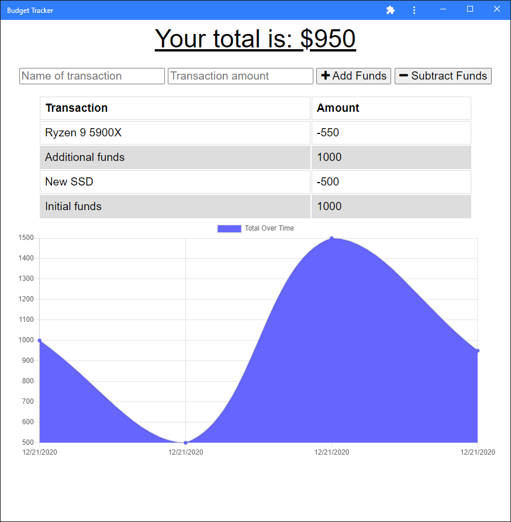

# Budget Tracker

## Description

A progressive web app (PWA) to track your budget on the go. Static assets and api GET requests are cached for offline use. If you go offline and post data to the server, it will be saved to be sent back to the server once you are back online.

## Made with
- Node.js
- Express
- MongoDB
- Mongoose
- IndexedDB
- Service workers

## Installation

To install necessary dependencies, run the following command:

```
npm i
```

## Usage

Run
```
npm start
```

Or view the live app on Heroku by clicking the image below

[](https://dry-journey-39799.herokuapp.com/)
